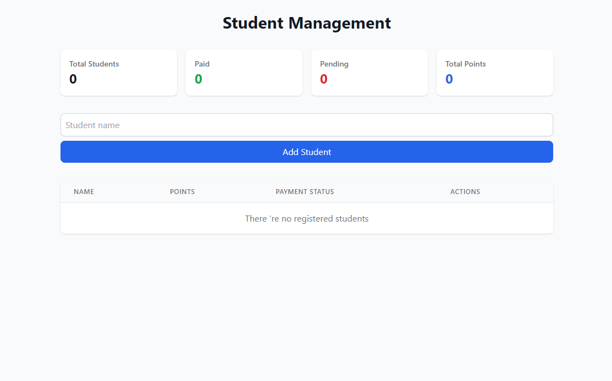

Aquí tienes un **README.md** listo para usar en GitHub, con formato adecuado y una estructura clara:  

---

```md
# 🎓 Student Management App

## 📌 Descripción  
**Student Management App** es una aplicación desarrollada con **React, TypeScript y Tailwind CSS** que permite gestionar estudiantes, controlar su estado de pago y monitorear sus puntos acumulados de manera intuitiva y eficiente.

## 🚀 Tecnologías utilizadas  
- ⚛️ **React** con **TypeScript** para un desarrollo estructurado y tipado.  
- 🎨 **Tailwind CSS** para un diseño moderno y responsivo.  
- ⚡ **Vite** para un entorno de desarrollo rápido y optimizado.  

## ✨ Características  
✅ Muestra el número total de estudiantes registrados.  
✅ Indica cuántos estudiantes han **pagado** y cuántos tienen pagos **pendientes**.  
✅ Lleva un registro del **total de puntos** acumulados.  
✅ Permite **agregar nuevos estudiantes** mediante un campo de entrada.  
✅ Interfaz limpia, minimalista y completamente **responsiva**.  

## 📥 Instalación y ejecución  

1. Clona el repositorio:  
   ```bash
   git https://github.com/chicibelito70/Student-Points-Management-System.git
   cd student-management
   ```  
2. Instala las dependencias:  
   ```bash
   npm install  
   # o  
   yarn install  
   ```  
3. Inicia el servidor de desarrollo:  
   ```bash
   npm run dev  
   # o  
   yarn dev  
   ```  

## 🎮 Uso  
1. Ingresa el nombre del estudiante en el campo de entrada.  
2. Haz clic en **"Add Student"** para registrarlo.  
3. Observa las métricas de pagos y puntos reflejadas en la interfaz.  

## 🛠 Contribución  
Si deseas mejorar la aplicación, ¡eres bienvenido! Abre un **issue** o envía un **pull request**.  

## 📄 Licencia  
Este proyecto está bajo la licencia **MIT**.  

## 🎥Evidencias



[🎥 Ver video](Video.mp4)

---

📌 _Desarrollado con ❤️ usando React, TypeScript y Tailwind CSS._  
```

---

✅ Este README tiene formato de **GitHub**, con iconos para hacerlo más visual.  
Si necesitas agregar capturas de pantalla, documentación de API o cualquier otra sección, dime y lo ajustamos. 🚀